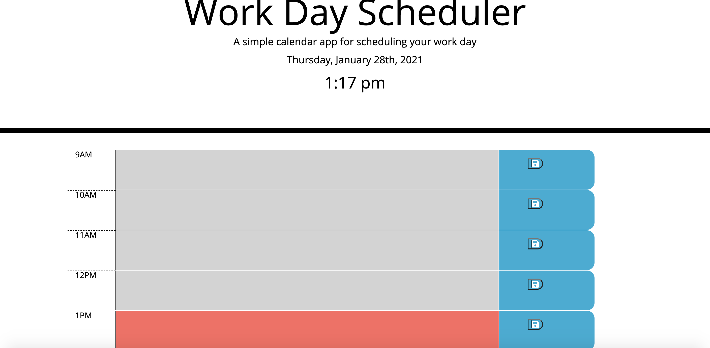
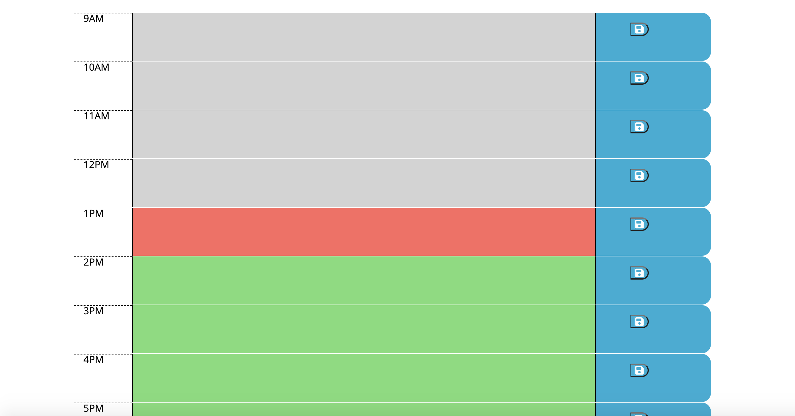
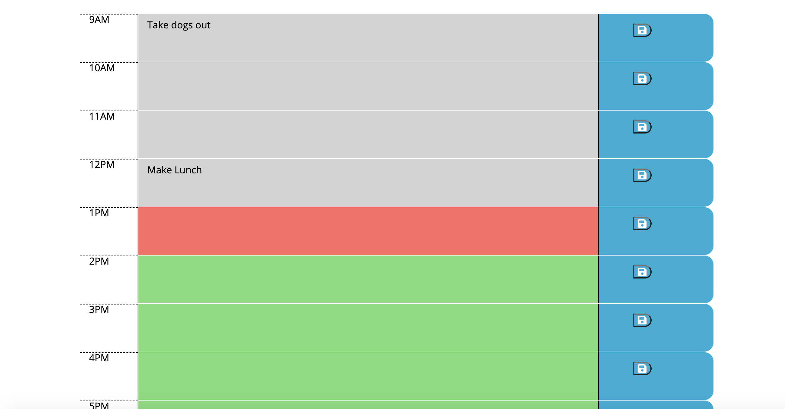

# Work_Day_Scheduler

## User Story

With the completion of this assignment, I was able to implement code via HTML, CSS, and JS in order to create a work-day scheduler for a busy client. By using moment.js I grabbed the current day and current time and displayed both in the header of the planner. I created 8 columns to represent an 8 hour work day that coincides with the current hour of the day. By using the styles 'past', 'present', and 'future' I color coded each column grey, red, and green respectively. For each column when the save button is pressed, the text that is written in by the user will be saved. When the page is refreshed, the text will remain.

## Deployed Link

https://daveymanuel.github.io/Work_Day_Scheduler/

## Screenshots

## Logic

### If/Else for Styling Change to <textarea>

Using the class "textInput" for all of my textareas I was able to use JQuery to grab this selector and use the 'each' function to set appropriate functionality based on the hour. I created a variable that selected each data attribute which was then used to compare to the current hour given to us by using moment.js. If the data-number was less than the current hour I set the style to 'past' which would give it a grey color. If the data-number was equal to the current hour I set the style to 'present' which gave the column a red color. Lastly I set the styling of my columns to 'future' if the other two criteria were untrue, rather if the hours were still yet to come, and gave the columns a green color.

### Local Storage (Get)

In order to get the value inputted by the user for each column, I had to use localStorage.getItem to grab the value of each textarea. I then gave each column its own unique key dependent on the hour. 

### Save Button Functionality

Using the shared class of 'saveBtn' I used the on click function to set the value of each textarea to our local storage. The key was set to the unique key given in the previous section, and the value was set to each textarea value (text as string inputted by user).
